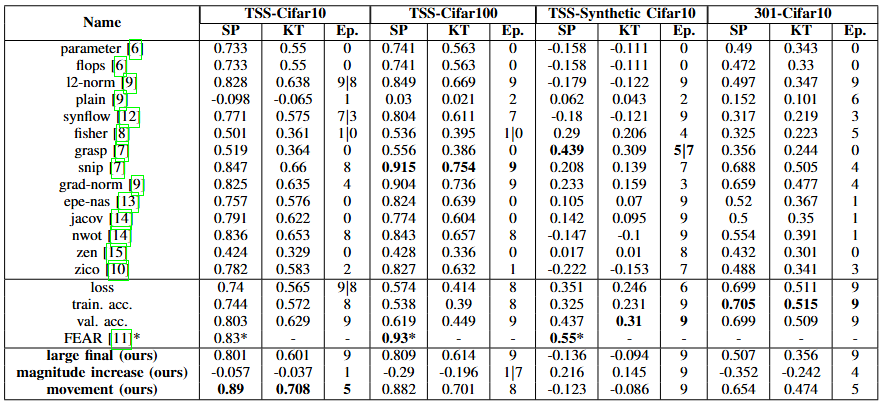
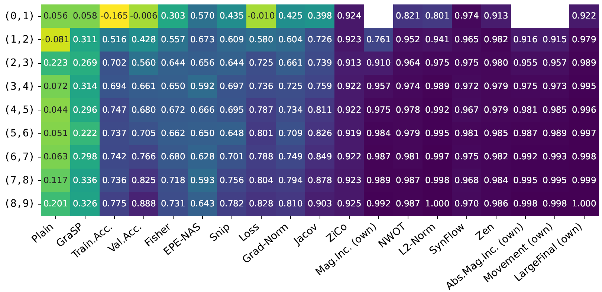
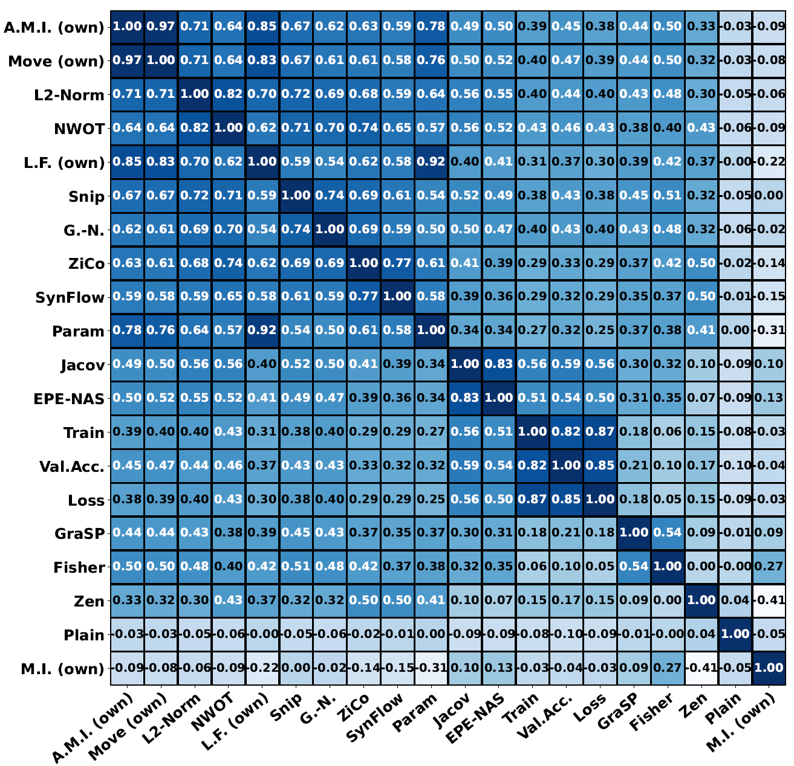

# NAS Benchmark Proxy Evaluation

## Overview
This repository evaluates Zero-Cost Proxies from scratch and trains networks while assessing Few-Cost Proxies after each epoch. The project is designed to work with two different search spaces:
- **NAS-Bench-201** (also known as **NATS-Bench-TSS**) 
- **NAS-Bench-301**

## Datasets
The repository supports multiple datasets:

### **For NATS-Bench-TSS (NAS-Bench-201):**
- **CIFAR-10-valid**
- **CIFAR-100**
- **Synthetic CIFAR-10**
- **Spherical CIFAR-100**

### **For NAS-Bench-301:**
- **CIFAR-10-301**

## Directory Structure
- **`nasbench201/`** → Related Code for NAS-Bench-201
- **`nasbench301/`** → Related Code for NAS-Bench-301
- **`trained_networks/`** → Fully trained accuracies for *Synthetic CIFAR-10* and *Spherical CIFAR-100*.
- **`output/`** → Contains evaluated proxies.
- **`visualization/`** → Can generate:
  - Correlation to final accuracy 
  - Epoch correlation 
  - Proxy correlation 


## Installation
To set up the environment, install the dependencies using the provided `environment.yml` file:
```bash
conda env create -f environment.yml
conda activate <your_env_name>
```
### **Additional Downloads**
After installation, the following datasets and API need to be downloaded manually:
- **NAS-Bench-201 API**: [Download](https://drive.google.com/file/d/16Y0UwGisiouVRxW-W5hEtbxmcHw_0hF_/view)
  - **Path**: `./nasbench201/nas_201_api/`
- **Synthetic CIFAR-10 Dataset**: [Download](https://drive.google.com/file/d/1FljWi06m6X7_QugikGgEp7btQHd2gPRB/view?usp=drive_link)
  - **Path**: `./nasbench201/dataset/synthetic/`
- **Spherical CIFAR-100 Dataset**: [Download](https://drive.google.com/file/d/1apC-oNakf6M01sNrgNJHIKCP34liGRW9/view?usp=sharing)
  - **Path**: `./nasbench201/dataset/spherical/`
- **NB301 CIFAR-10 Results**: [Download](https://drive.google.com/file/d/1MXYUyT-PtOS04AYraazg8xujTuY7EXOZ/view?usp=drive_link)
  - **Path**: `./nasbench301/datasets/nb_301_v13_lc_iclr_final/rs/`


## Running Proxy Evaluation
To run the proxy evaluation, execute:
```bash
python main.py --dataset <dataset_name>
```
Possible values for `--dataset`:
- `cifar10-valid`
- `cifar100`
- `syn_cifar10`
- `scifar100`
- `nb301_cifar10`

## Visualizing Results
To visualize the evaluation results, run:
```bash
python main_visualize.py --dataset <dataset_name>
```

## Acknowledgements
This project utilizes the following repositories:
- [NAS-Bench-301](https://github.com/automl/nasbench301)
- [NATS-Bench](https://github.com/D-X-Y/NATS-Bench)
- [NASLib (Zero-Cost Branch)](https://github.com/automl/naslib/tree/zerocost)
- [ZiCo](https://github.com/SLDGroup/ZiCo)

## License
This project is licensed under the **Apache License 2.0**. See the [LICENSE](LICENSE) file for details.

## Citation
If you use this repository in your research, please cite it accordingly:

```
@inproceedings{kollek2024empirical,
  title={Empirical Study on the Impact of Few-Cost Proxies},
  author={Kollek, Kevin and Braun, Marco and Meusener, Jan-Hendrik and Krabbe, Jan-Christoph and Kummert, Anton},
  keywords={own},
  booktitle={2024 IEEE International Symposium on Circuits and Systems (ISCAS)},
  pages={1--5},
  year={2024},
  organization={IEEE}
}
```


